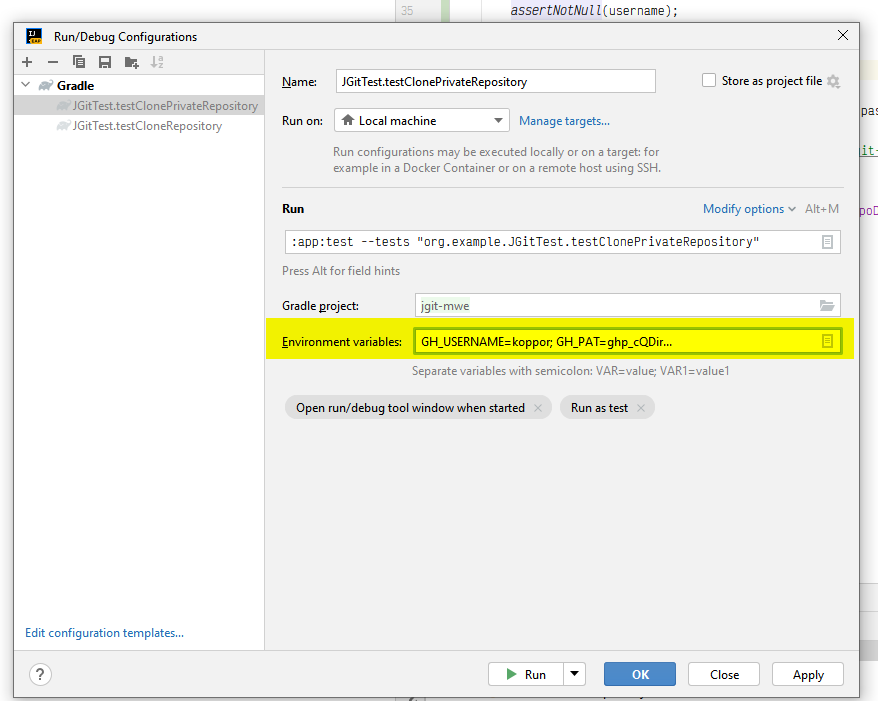

# jgit-mwe

MWE for jgit

## Smoke run

1. Open the folder in IntelliJ
2. Navigate to `JGitTest` (possibly using <kbd>Ctrl</kbd>+<kbd>N</kbd> and then typing `JGitTest` and then pressing <kbd>Enter</kbd>)
3. Run the test `testCloneRepository` by clicking on the green arrow next to the class name

## Debug run

1. Open the folder in IntelliJ
2. Navigate to `JGitTest` (possibly using <kbd>Ctrl</kbd>+<kbd>N</kbd> and then typing `JGitTest` and then pressing <kbd>Enter</kbd>)
3. Set a breakpoint by clicking on the left margin next to the line number of `assertTrue(Files.exists(repoDir));`
4. Run the test `testCloneRepository` in debug mode by clicking on the green bug next to the method name
5. Wait
6. You should see in the console an output similar to `INFO: Cloned repository to C:\Users\koppor\AppData\Local\Temp\junit-6524094164121122642`
7. Open "git bash"
8. Execute `cd "C:\Users\koppor\AppData\Local\Temp\junit-6524094164121122642"`
9. You are in the repository folder now and you can use your git tools to inspect the repository

## Run with creditentials

The test `testClonePrivateRepository` requires credentials.

It requires two environment variables be set:

- `GH_USERNAME`: Your GitHub username
- `GH_PAT`: Your GitHub Personal Access Token. The simplest way to create one is using a [classic PAT](https://docs.github.com/en/authentication/keeping-your-account-and-data-secure/managing-your-personal-access-tokens#creating-a-personal-access-token-classic) with the `repo` scope.

You can set them in IntelliJ by clicking at the top right the green arrow next to the class name, then "Edit Configurations...", then "Configuration" tab, then "Environment variables" and then adding the two variables.
You can also it per test run settings:

